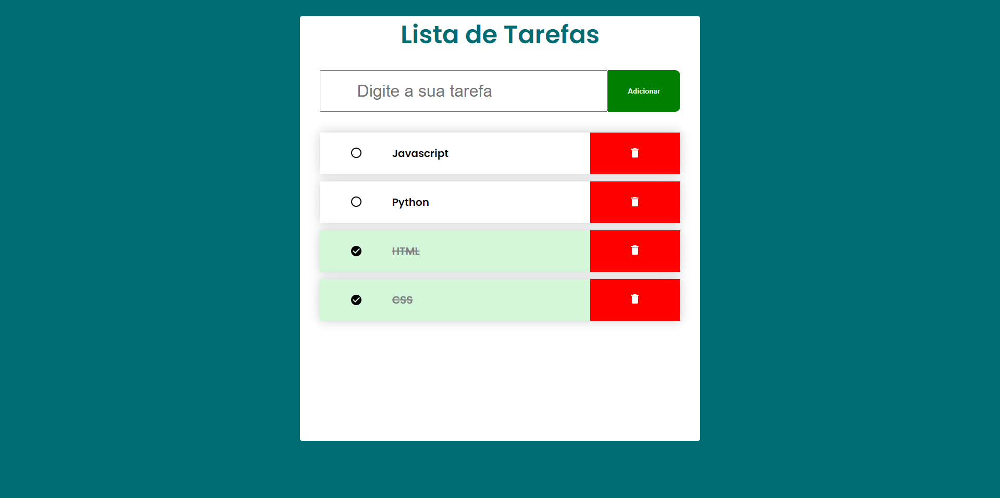

<h1 align="center">Lista de Tarefas :clipboard:</h1>

## :memo: Descrição
Lista de tarefas onde você pode indicar quando uma atividade foi concluída e também adicionar ou remover novas tarefas.  
Acesse: <a href="https://thedouglasaraujo.github.io/to-do-list/" target="_blank">https://thedouglasaraujo.github.io/to-do-list/</a>

## :wrench: Tecnologias utilizadas
- Javascript
- HTML
- CSS

## :camera: Imagens
 

  

